# UAS_Pemrograman-Web-1

## Video Demo Project

## Screenshots Project

Berikut beberapa tampilan (screenshot) dari aplikasi WorldBike yang telah saya kembangkan, mulai dari halaman awal, fitur utama pengguna, hingga halaman admin.

---

### 1. Register
Halaman pendaftaran akun untuk pengguna baru dengan mengisi data agar dapat mengakses seluruh fitur website WorldBike.

  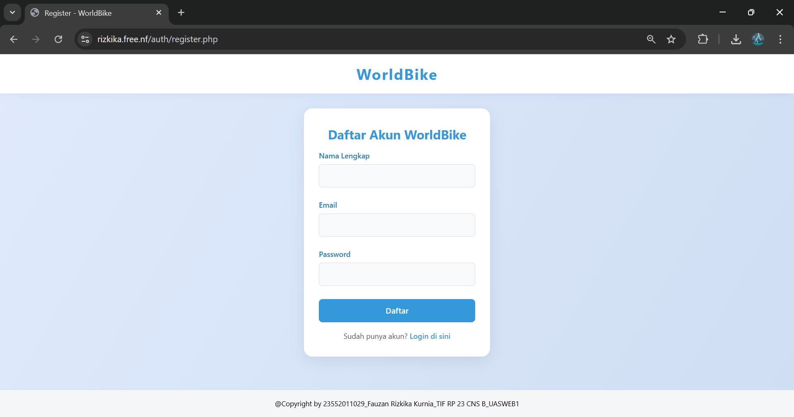

---

### 2. Login  
Halaman untuk masuk ke web menggunakan akun yang sudah terdaftar agar pengguna dapat mengakses fitur WorldBike.

  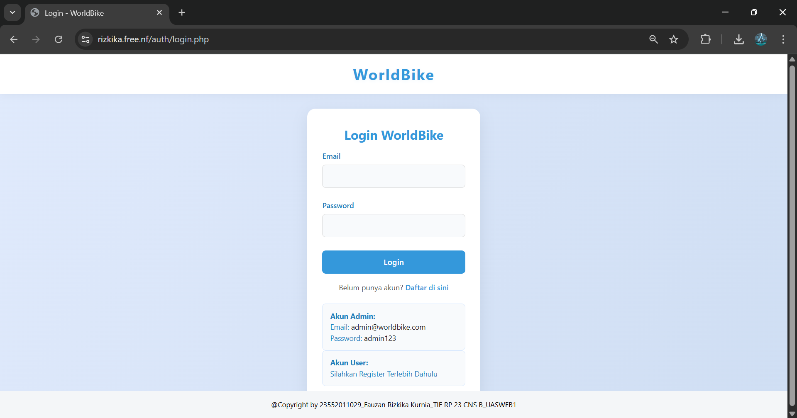

---

### 3. Home  
Menampilkan halaman utama yang berisi informasi ringkas, kategori sepeda, dan akses cepat ke fitur utama WorldBike.

  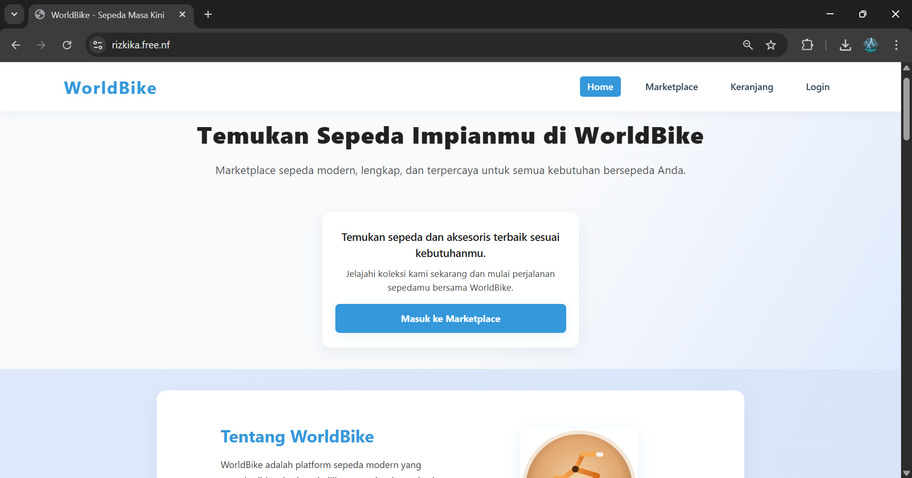

  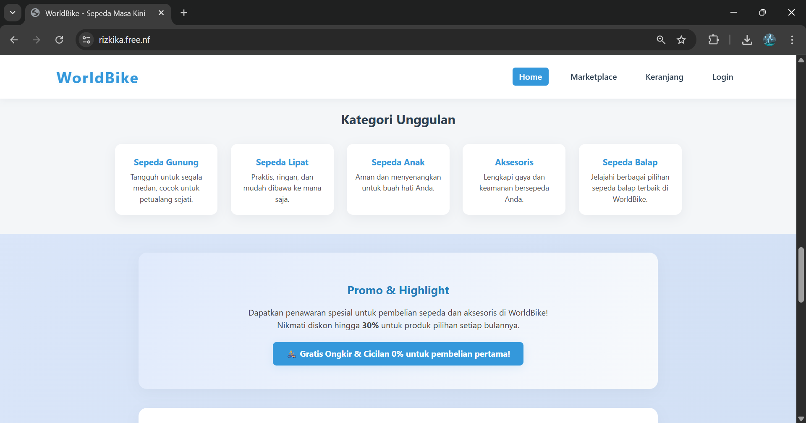

---

### 4. Marketplace
Menampilkan halaman yang berisi produk produk dari berbagai kategori yang dapat di beli.

  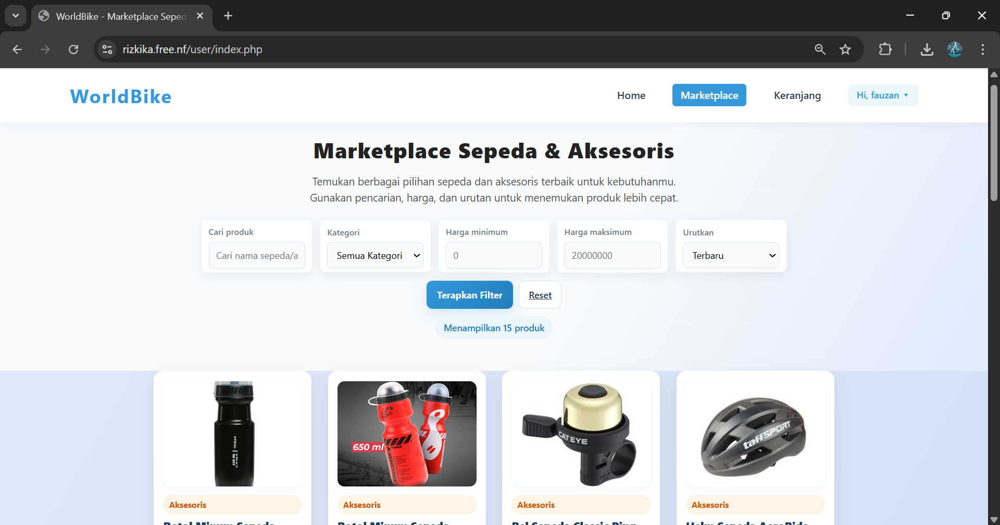

  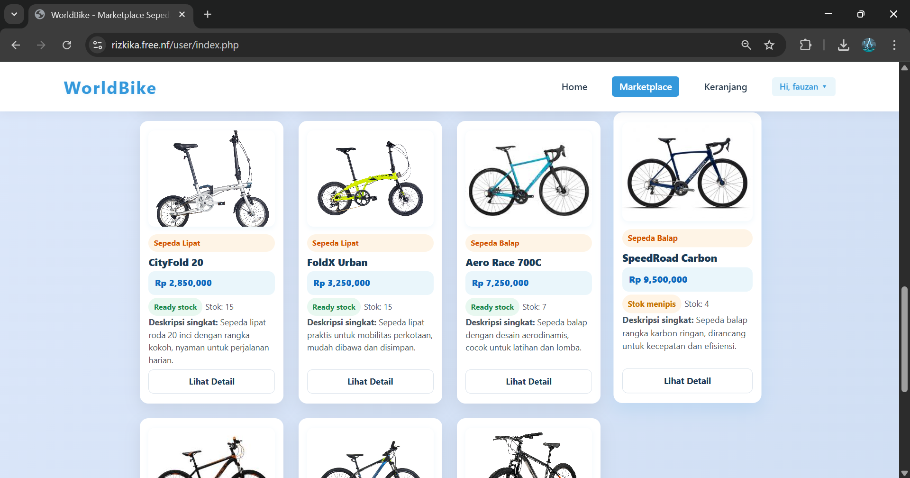

---

### 5. Detail
Menampilkan halaman detail dari produk yang di klik yang didalamnya juga bisa memilih apakah langsung beli atau masukkan ke keranjang.

  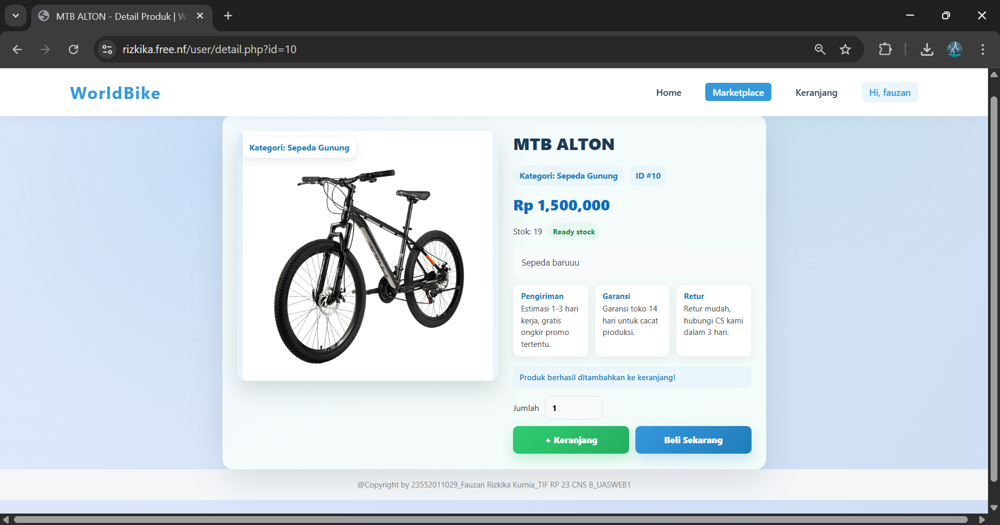

---

### 6. Keranjang
Menampilkan halaman yang berisi produk-produk yang telah dimasukkan ke keranjang yang nantinya bisa di checkout berbarengan.

  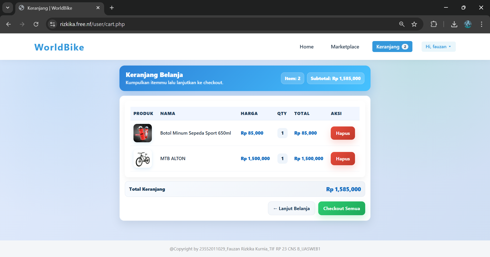

---

### 7. Pembayaran
Menampilkan halaman pembayaran yang harus mengisi data diri terlebih dahulu dan memilih metode pembayaran

  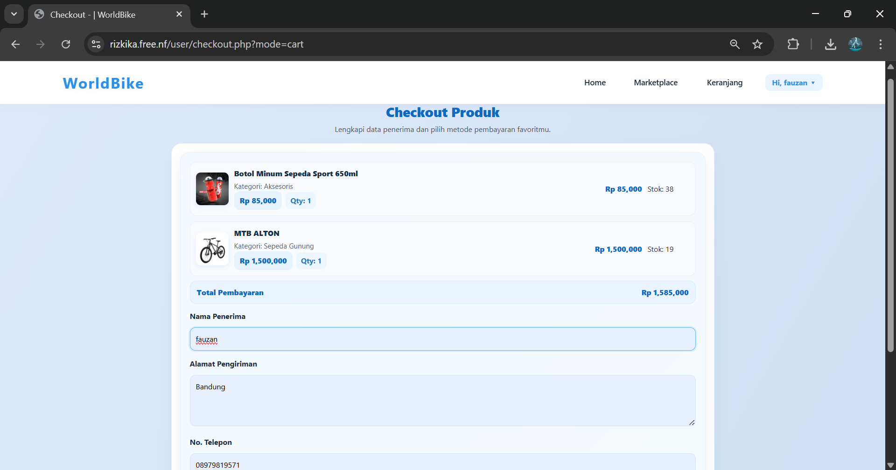

---

### 8. Pembayaran Sukses
Menampilkan halaman pembayaran yang telah sukses di lakukan, berisi info terhadap produk yang telah di beli.

  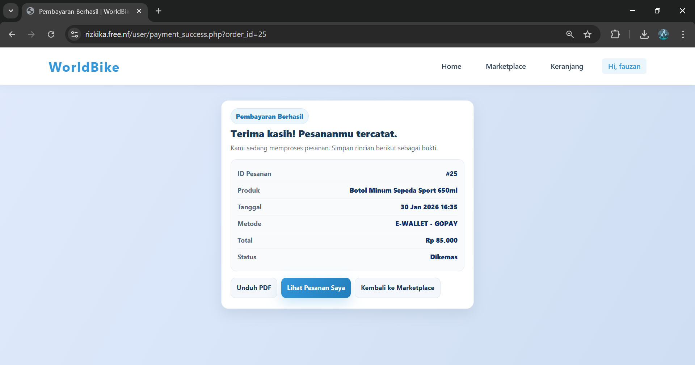

---

### 9. Profil & Edit Profil
Menampilkan halaman yang berisi data user yang telah login. Didalamnya juga pengguna bisa melihat riwayat pesanan yang telah dilakukan.
Lalu ada juga halaman edit profil yang bisa digunakan untuk mengubah nama dan menambahkan atau menghapus foto profil.

  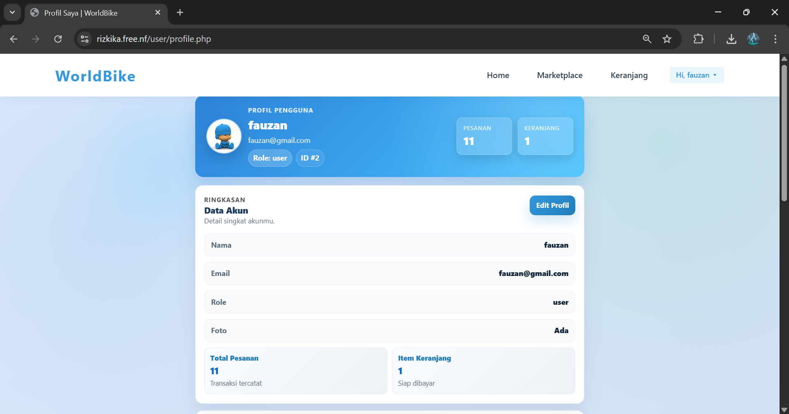

  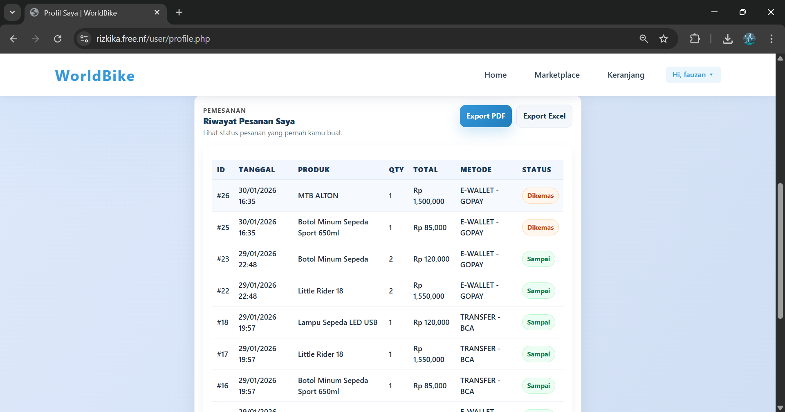

  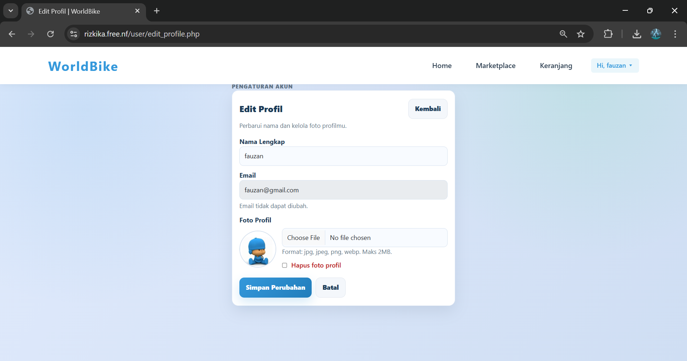

---

### 10. Dashboard Admin
Menampilkan halaman dashboard admin yang didalamnya dapat mengelola produk, kategori, melihat pesanan, melihat data user yang telah login.

  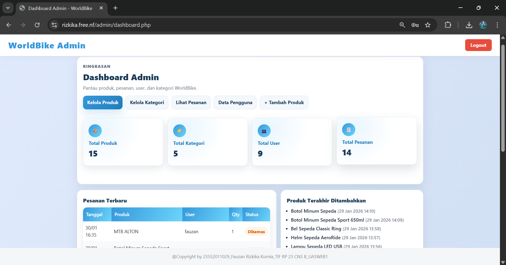

  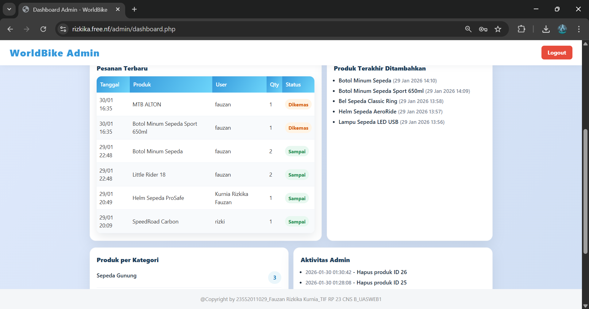

---
